# Uber Data Analytics
### Analyzing Data and Arriving at Better Solutions Through Machine Learning


---

## Title Page & Authors

**Uber Data Analytics — Analyzing data and arriving at better solutions through machine learning**

**Authors**
- Sultan Ahmad Qarqash, 202120556

**Department:** Business Intelligence and Data Analytics

**Course:** Graduation Project in Business Intelligence and Data Analytics

**Semester:** First Semester, 2025/2026

**Date:** _TODO — add submission date_

> _Supervisor: TODO — add supervisor name (not present in the source document)._

---

## Table of Contents

- [Abstract](#abstract)
- [Acknowledgment](#acknowledgment)
- [Business Intelligence Project Description and Objectives](#business-intelligence-project-description-and-objectives)
- [Data Research and Acquiring Effort](#data-research-and-acquiring-effort)
- [Data Description and Understanding](#data-description-and-understanding)
- [Data Primary Cleaning and Transformation](#data-primary-cleaning-and-transformation)
- [Data Visualization and Insights](#data-visualization-and-insights)
- [Dashboard Design & Business Insights](#dashboard-design--business-insights)
- [Advanced Analytics and AI Modeling](#advanced-analytics-and-ai-modeling)
- [Tools Research and Selection Effort](#tools-research-and-selection-effort)
- [Project Deployment Effort – Use Case](#project-deployment-effort--use-case)
- [Results](#results)
- [References](#references)

---

## Abstract

> _Note: the original Word document did not contain an explicit Abstract. The draft below was assembled from the project's own Introduction, AI section, and Results so the required section is not left empty. Review and adjust as needed._

Ride-booking and delivery applications such as Uber and Careem have become part of daily life both globally and in Jordan, offering fast and convenient transportation. Despite their advantages, these platforms face challenges including trip cancellations, delays, pricing inconsistencies, and variations in service quality. This project analyzes a large ride-booking dataset to understand user behavior and identify the key factors that influence booking outcomes, especially cancellations.

The project combines descriptive analysis, interactive dashboards, and machine learning. After cleaning and transforming a dataset of roughly 148,770 bookings, the work delivers exploratory analysis of demand, vehicle types, payment methods, and geography, followed by an interactive BI dashboard. Three predictive models were then built: a Decision Tree Regressor for ride-demand forecasting, a deep Artificial Neural Network (ANN) for spatio-temporal ride-count prediction per hour and region, and a binary ANN classifier to predict whether a booking will be completed or cancelled.

The models performed strongly: the Decision Tree Regressor reached about 93.83% accuracy (MAE ≈ 0.118), the spatio-temporal ANN reached about 95.89% accuracy, and the cancellation classifier reached a testing accuracy near 99.75% with an F1-score of 1.00. Key findings include a 65.96% completion rate, customers driving the majority of cancellations (19.15% vs. 7.45% for drivers), demand peaks in January and July and after noon on Saturdays and Mondays, and UPI dominating payments. The study closes with recommendations for proactive driver positioning, improved address validation, and fleet-capacity adjustments, with a discussion of localized impact for Jordan.

---

## Acknowledgment

> _TODO — the source Word document did not include an acknowledgment. Add thanks to your supervisor, department, family, and anyone who supported the project._

---

## Business Intelligence Project Description and Objectives

In recent years, ride-booking and delivery applications such as Uber, Careem, and similar platforms have become widely used both globally and in Jordan. These applications are now part of people's daily lives, offering convenient, fast, and relatively safe transportation solutions. This rapid growth represents a significant transformation in how individuals move within cities, making transportation more accessible and efficient.

Despite these advantages, these platforms are not without challenges. Issues such as trip cancellations, delays, pricing inconsistencies, and variations in service quality can negatively impact user experience and operational efficiency. Understanding these challenges is essential for improving the performance of such systems and ensuring customer satisfaction.

**What the project is about:** analyzing ride-booking data to better understand user behavior and identify the key factors that influence booking outcomes, especially cancellations.

**Business domain:** ride-hailing / intelligent transportation and urban mobility.

**The business problem.** Ride-hailing platforms suffer from operational inefficiencies caused by a mismatch between driver supply and customer demand. This manifests in two critical areas:
- **Demand and density uncertainty** — the inability to accurately predict how many rides will be required per hour in specific regions leads to long customer wait times and lost driver income during low-demand periods.
- **High cancellation rates** — unexpected cancellations by drivers or customers create friction, reduce platform reliability, and cause revenue losses.

**Objectives.** By applying data analysis techniques and machine learning models, the project seeks to uncover patterns, generate insights, and predict whether a ride will be completed or cancelled. The ultimate goal is to provide data-driven solutions that reduce common issues, enhance service quality, and support better decision-making in ride-booking systems.

---

## Data Research and Acquiring Effort

**Data searched for and why.** The project required a comprehensive ride-sharing operational dataset covering bookings, vehicle types, cancellations, customer behavior, ratings, payments, geography, and financial metrics — enough breadth to support both descriptive analysis and machine-learning models for demand forecasting and cancellation prediction.

**How it was acquired.** The dataset was obtained from a public Kaggle dataset (Uber Ride Analytics Dashboard).

**Link to raw data source:**
- Kaggle — Uber Ride Analytics Dashboard: https://www.kaggle.com/datasets/yashdevladdha/uber-ride-analytics-dashboard/code

**Description of the source.** The dataset captures **148,770 total bookings** across multiple vehicle types and provides a complete view of ride-sharing operations, including successful rides, cancellations, customer behaviors, and financial metrics, with full-year 2024 coverage at daily granularity across multiple pickup and drop locations in the Delhi / Gurgaon / Noida region.

---

## Data Description and Understanding

### Key statistics

- **Total Bookings:** 148.77K rides
- **Success Rate:** 65.96% (≈ 93K completed rides)
- **Cancellation Rate:** 25% (≈ 37.43K cancelled bookings)
- **Customer Cancellations:** 19.15% (≈ 27K rides)
- **Driver Cancellations:** 7.45% (≈ 10.5K rides)

### Data Dictionary (Table 1)

| Column Name | Description |
| --- | --- |
| Date | Date of the booking |
| Time | Time of the booking |
| Booking ID | Unique identifier for each ride booking |
| Booking Status | Status of booking (Completed, Cancelled by Customer, Cancelled by Driver, etc.) |
| Customer ID | Unique identifier for customers |
| Vehicle Type | Type of vehicle (Go Mini, Go Sedan, Auto, eBike/Bike, UberXL, Premier Sedan) |
| Pickup Location | Starting location of the ride |
| Drop Location | Destination location of the ride |
| Avg VTAT | Average time for driver to reach pickup location (in minutes) |
| Avg CTAT | Average trip duration from pickup to destination (in minutes) |
| Cancelled Rides by Customer | Customer-initiated cancellation flag |
| Reason for cancelling by Customer | Reason for customer cancellation |
| Cancelled Rides by Driver | Driver-initiated cancellation flag |
| Driver Cancellation Reason | Reason for driver cancellation |
| Incomplete Rides | Incomplete ride flag |
| Incomplete Rides Reason | Reason for incomplete rides |
| Booking Value | Total fare amount for the ride |
| Ride Distance | Distance covered during the ride (in km) |
| Driver Ratings | Rating given to driver (1–5 scale) |
| Customer Rating | Rating given by customer (1–5 scale) |
| Payment Method | Method used for payment (UPI, Cash, Credit Card, Uber Wallet, Debit Card) |

### Exploratory Data Analysis

**Vehicle fleet coverage (Table 2)**

| Vehicle Type | Total Bookings | Success Rate | Avg Distance | Total Distance |
| --- | --- | --- | --- | --- |
| Auto | 12.88M | 91.1% | 25.99 km | 602K km |
| eBike/Bike | 11.46M | 91.1% | 26.11 km | 537K km |
| Go Mini | 10.34M | 91.0% | 25.99 km | 482K km |
| Go Sedan | 9.37M | 91.1% | 25.98 km | 433K km |
| Premier Sedan | 6.28M | 91.2% | 25.95 km | 292K km |
| UberXL | 1.53M | 92.2% | 25.72 km | 72K km |

**Revenue distribution by payment method**
- UPI: highest contributor (~40% of total revenue)
- Cash: second highest (~25%)
- Credit Card: ~15%
- Uber Wallet: ~12%
- Debit Card: ~8%

**Cancellation patterns**

_Customer cancellation reasons:_ Wrong Address 22.5%, Driver Issues 22.4%, Driver Not Moving 22.2%, Change of Plans 21.9%, App Issues 11.0%.

_Driver cancellation reasons:_ Customer Related Issues 25.3%, Capacity Issues 25.0%, Personal & Car Issues 24.9%, Customer Behavior 24.8%.

**Rating analysis**
- Customer ratings: consistently high across all vehicle types (4.40–4.41)
- Driver ratings: slightly lower but stable (4.23–4.24)
- Highest rated: Go Sedan (4.41 customer rating)
- Most satisfied drivers: UberXL category (4.24 rating)

**Data quality**
- **Completeness:** comprehensive coverage with minimal missing values
- **Consistency:** standardized vehicle types and status categories
- **Temporal coverage:** full-year 2024 data with daily granularity
- **Geographic scope:** multiple pickup and drop locations
- **Balanced distribution:** good representation across all vehicle types and time periods

### Geographic Context — Pickup → Drop Transportation Network (Delhi / Gurgaon / Noida)

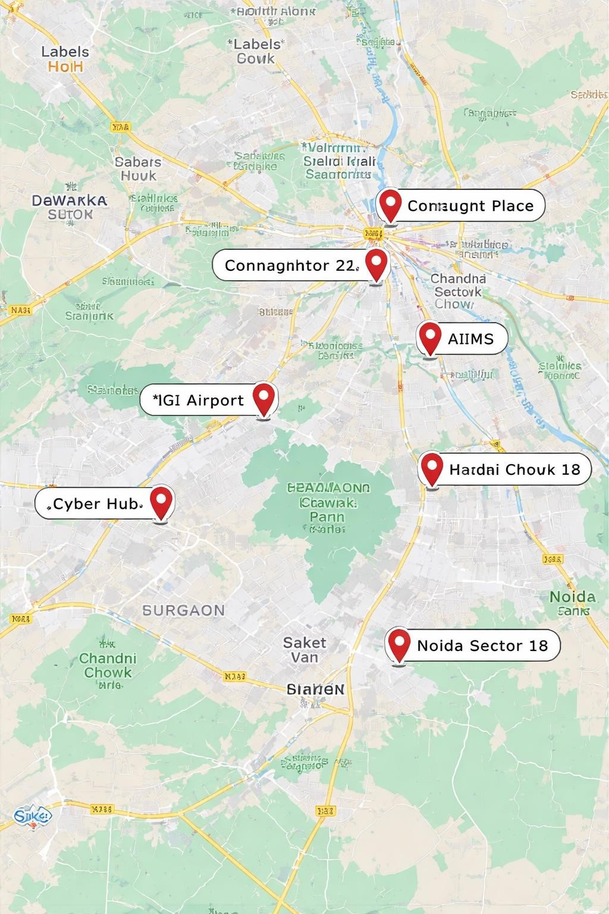

The map above shows the operating area analyzed in this project. The key regions are described below.

**1. Connaught Place** — *Central New Delhi.* Commercial and administrative center, major transportation hub, very high traffic density.


**2. Cyber Hub (Gurgaon)** — *Gurgaon.* Modern business district, high concentration of offices and restaurants, strong day and night activity.


**3. IGI Airport (Indira Gandhi International Airport)** — *New Delhi.* Main international airport, major travel hub, very high passenger demand.


**4. AIIMS** — One of the largest hospitals in India, continuous movement of patients, staff and students, high transportation demand.

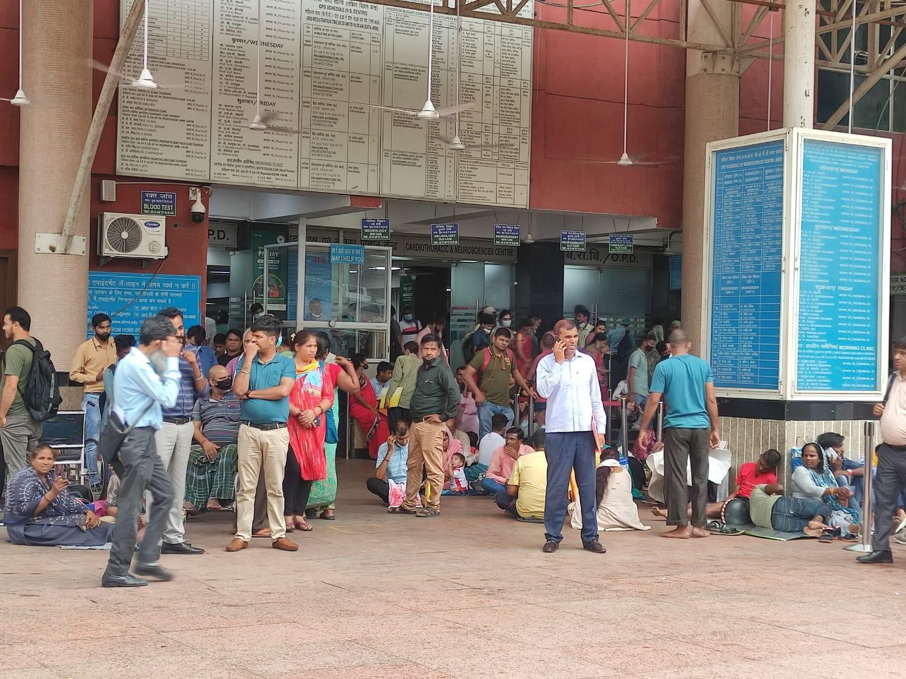

**5. Noida Sector 18** — Large residential area, close to airport connectivity, frequent daily commuting.

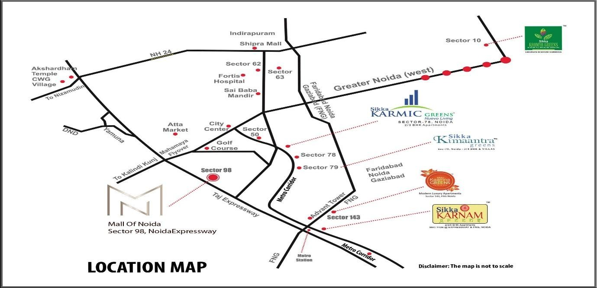

**6. Dwarka Sector 21** — *West Delhi.* Large residential area, close to airport connectivity, frequent daily commuting.


**7. Chandni Chowk** — *Old Delhi.* Historic market area, extremely high population density, heavy traffic and congestion.


**8. Saket** — *South Delhi.* Mixed residential and commercial area, popular shopping destinations, moderate to high demand.


---

## Data Primary Cleaning and Transformation

**Before cleaning (Table 3)**

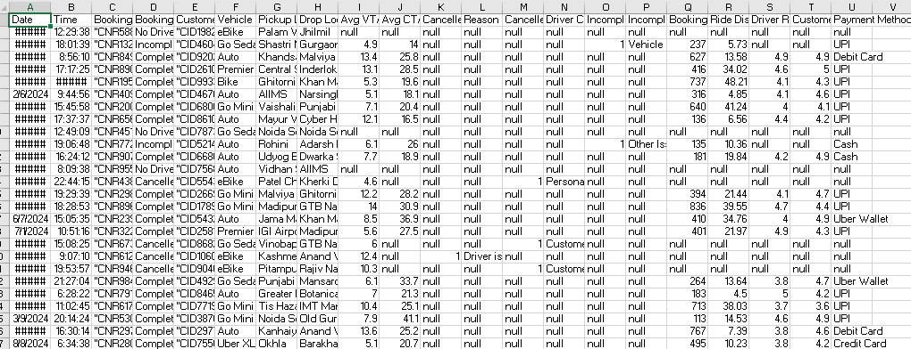

The following preparation steps were applied, in sequence:

1. **Duplicate check** — after verifying the data, no duplicate records were found.
2. **Booking Value** — empty values were filled with the lowest trip price, then the currency was converted from Indian rupees to US dollars.
3. **Customer Rating and Driver Rating** — empty values were filled with the arithmetic mean of each column.
4. **Ride Distance** — empty values were filled with the arithmetic mean.
5. **Avg VTAT and Avg CTAT (average access/arrival times)** — empty values were filled with the arithmetic mean.
6. **Cancellation / incomplete columns** — for "Cancelled Rides by Customer", "Reason for cancelling by Customer", "Cancelled Rides by Driver", "Driver Cancellation Reason", "Incomplete Rides", and "Incomplete Rides Reason", empty values were filled with the word "Completed".
7. **Payment Method** — empty values were filled with the word "Unpaid".
8. **Type conversion** — each column was converted to its proper type (number or text).
9. **Sorting** — the data was sorted by date from oldest to newest.

**After cleaning (Table 4)**

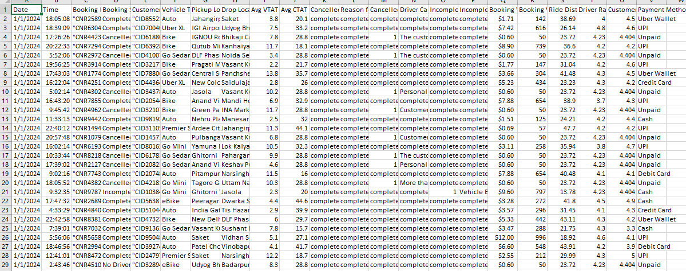

---

## Data Visualization and Insights

This section presents the descriptive analysis built on the cleaned data.

> _Reviewer note: the descriptive-analysis pivot tables below total 150,000 rows, while the Dataset Overview reports 148,770 bookings. Consider reconciling the two figures (e.g., pre- vs. post-cleaning counts) in your final version._

### Number of delivery orders during each month (Table 5)

| Month | Count of Booking ID |
| --- | --- |
| Jan | 12,861 |
| Feb | 11,927 |
| Mar | 12,719 |
| Apr | 12,199 |
| May | 12,778 |
| Jun | 12,440 |
| Jul | 12,897 |
| Aug | 12,636 |
| Sep | 12,248 |
| Oct | 12,651 |
| Nov | 12,394 |
| Dec | 12,250 |
| **Grand Total** | **150,000** |

**Insight:** July has the highest number of delivery requests; February has the lowest.

### Number of vehicles by type (Table 6)

| Vehicle Type | Count of Customer ID |
| --- | --- |
| Auto | 37,419 |
| Bike | 22,517 |
| eBike | 10,557 |
| Go Mini | 29,806 |
| Go Sedan | 27,141 |
| Premier Sedan | 18,111 |
| Uber XL (blank) | 4,449 |
| **Grand Total** | **150,000** |

**Insight:** the vehicle mix differs from Jordan because of additional vehicle types available in this market.

### Cancelled orders — by driver or customer (Table 7)

| Status | Count of Booking ID |
| --- | --- |
| Cancelled by customer | 27,000 |
| Complete | 123,000 |
| Cancelled by driver | 10,500 |
| Complete (blank) | 112,500 |

**Insight:** customers cancel far more orders than drivers do.

### Payment method comparison (Table 8)

| Payment Method | Count |
| --- | --- |
| Cash | 25,367 |
| Credit Card | 10,209 |
| Debit Card | 8,239 |
| Uber Wallet | 12,276 |
| Unpaid | 48,000 |
| UPI | 45,909 |
| **Grand Total** | **150,000** |

**Insight:** cash is the most common explicitly recorded payment method, while UPI is the dominant digital method.

### Drop locations (Table 9)

A per-area count of bookings by drop location (selected rows; grand total 150,000): Adarsh Nagar 845, AIIMS 850, Akshardham 856, Ambience Mall 836, Anand Vihar 830, Ardee City 875, Ashok Vihar 851, DLF Phase 3 876, Dwarka Sector 21 856, Ghaziabad 878, Gurgaon Railway Station 891, Gurgaon Sector 56 894, Hauz Khas 892, Huda City Centre 774, …

**Insight:** the most visited drop area is **Gurgaon Sector 56** (894); the least visited is **Huda City Centre** (774), both in Gurgaon.

### Pickup locations (Table 10)

A per-area count of bookings by pickup location (selected rows; grand total 150,000): Adarsh Nagar 858, AIIMS 918, Akshardham 839, Ambience Mall 873, Ashok Park Main 884, Ashok Vihar 796, Badarpur 921, Badshahpur 868, Bahadurgarh 802, Yamuna Bank 824, …

**Insight:** the highest-demand pickup area is **Badarpur** in the AIIMS region (921); the lowest is **Ashok Vihar** (796).

---

## Dashboard Design & Business Insights

The interactive BI dashboard is organized into four views, each answering a set of business questions.

### 1. Overview — *What is the overall state of operations?*

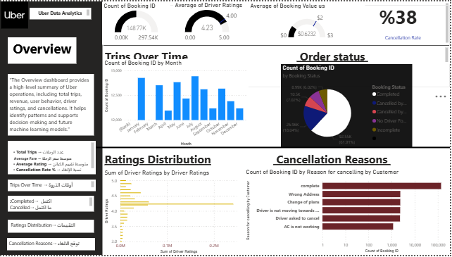

A high-level summary of Uber's operations: total trips, average driver rating, average booking value, and cancellation rate.
- **Total Trips:** 148K
- **Average Driver Rating:** 4.23
- **Average Booking Value:** $0.68
- **Cancellation Rate:** 38%

Components: a gauge for orders / average captain rating / average trip price; a column chart of trips over time; a pie chart of order status; bar charts of ratings distribution and cancellation reasons.

**Insights:** January and July have the highest delivery requests; April and October the lowest. 61% of orders were completed, and most cancellations came from customers. Most cancelled orders were due to the driver's request to the customer or a location error.

### 2. User Behavior — *How and when do users book?*

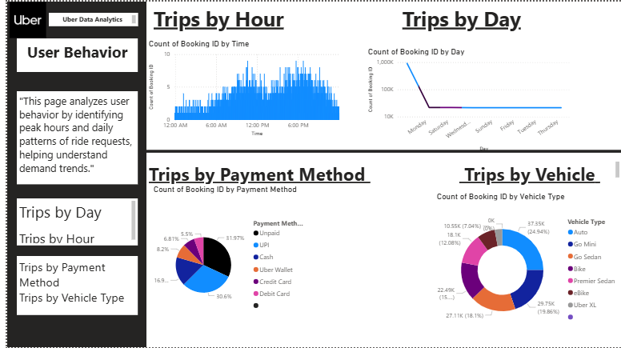

Explains user behavior through most frequent days and hours, vehicle type, and payment method. Components: line chart of trips by day, column chart of trips by hour, and pie/donut charts of trips by payment method.

**Insights:** Saturday and Monday have the highest order volumes; peak hours are after 12 PM. UPI (Unified Payments Interface) is the most widely used payment method — a secure, fast mobile-based electronic payment system widely adopted in India. "Auto" (automatic-transmission vehicles) is the most commonly used vehicle type.

### 3. Map Analysis — *Where is demand concentrated?*

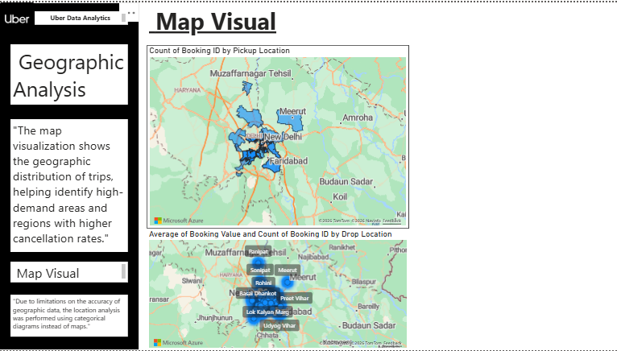

- **Pickup locations map:** shows the distribution of trips by origin, helping identify high-demand initiation areas. Areas such as New Delhi, Faridabad, and Meerut show higher pickup frequency.
- **Drop-off locations map:** visualizes average booking value and booking count by destination. Locations such as Sonipat, Meerut, and Rohini show a significant concentration of trips.
- The most popular arrival point was **Ashram**; the most common starting point was **Khandsa**.

**How this analysis can be used:** optimizing service coverage and fleet placement in high-demand regions; targeting high-value areas with promotions or surge pricing; improving operational efficiency through better routing and resource allocation; and understanding demand trends to forecast and scale operations.

### 4. Relationships — *How do variables relate to each other?*

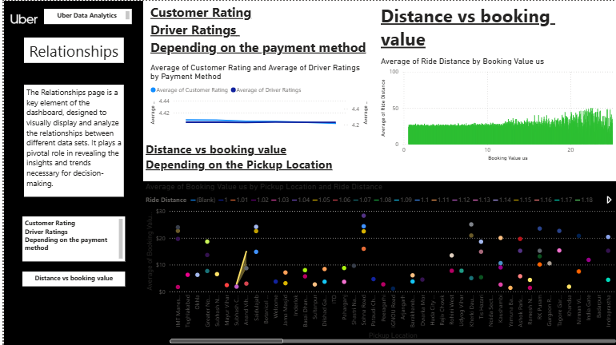

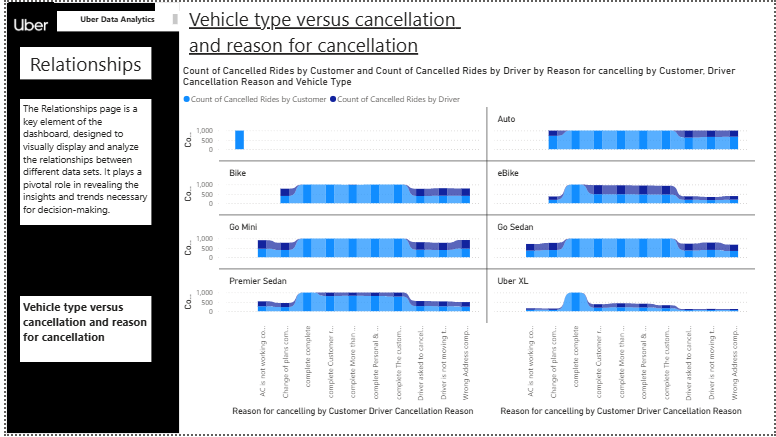

- **Customer and driver ratings by payment method:** evaluates how different payment methods correlate with service quality; a higher rating for a given method may signal user preference and trust.
- **Distance vs. booking value by pickup location:** a scatter analysis exploring whether longer distances correlate with higher booking values, to guide fare pricing by pickup point.
- **Distance vs. booking value (general):** longer distances tend to result in higher booking values; variance analysis highlights where pricing could be optimized.

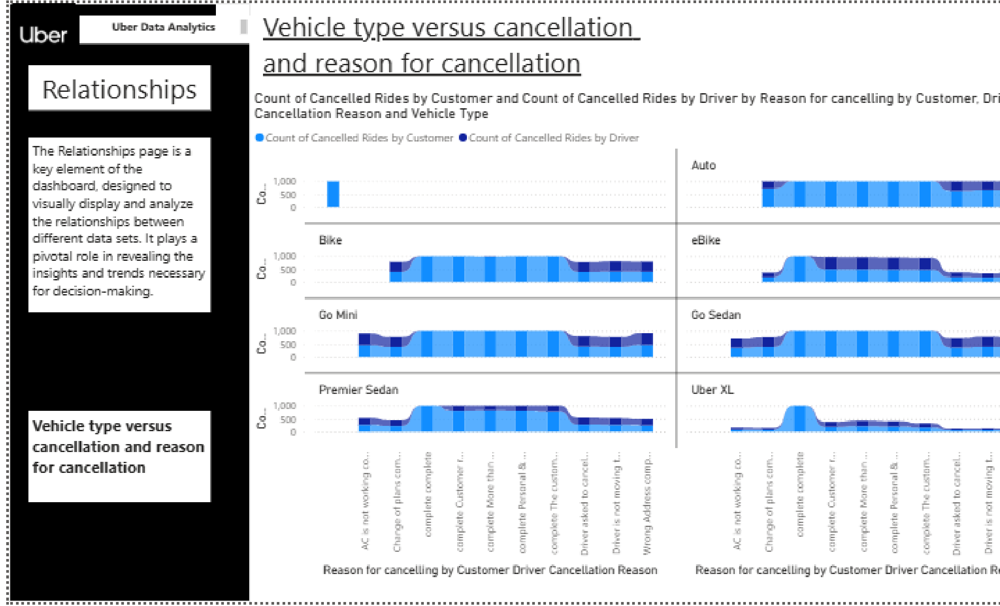

**Vehicle type vs. cancellations and reasons:** compares cancelled rides by customers vs. drivers across vehicle types (Auto, Go Mini, eBike, Premier Sedan, Uber XL), broken down by cancellation reason (e.g., AC not working, wrong address, driver unavailable, vehicle issues).

**How this analysis can be used:** identifying problematic vehicle types with high cancellation rates; improving customer and driver experience by addressing root causes (maintenance/training for driver-side issues, better location services for customer-side issues); optimizing fleet distribution; and applying targeted operational strategies for recurring issues.

**Conclusions:** the relationship between vehicle type and cancellation reasons highlights where attention is needed, and understanding both driver and customer cancellations enables proactive steps to reduce future cancellations.

---

## Advanced Analytics and AI Modeling

### Introduction

Intelligent Transportation Systems (ITS) and ride-hailing services rely heavily on data-driven technologies to maximize operational efficiency, improve customer satisfaction, and predict dynamic demand. This part of the project implements advanced AI methods — Deep Learning via Artificial Neural Networks (ANN) and traditional Machine Learning via Decision Trees — to solve core transport problems: predicting ride frequencies, forecasting geographic demand patterns, and classifying ride cancellation behavior.

### The Problem

Ride-hailing platforms suffer from operational inefficiencies due to a mismatch between driver supply and customer demand, manifesting as **demand and density uncertainty** (inaccurate per-hour, per-region ride prediction) and **high cancellation rates** (unexpected cancellations that reduce reliability and revenue).

### The Proposed AI Solution

Three tailored predictive frameworks were built:

1. **Ride Frequency Prediction (Regression)** — Decision Tree Regressor and deep neural networks to forecast the continuous count of rides. The regression model achieved ≈ **93.76% accuracy** and a low **MAE of 0.119**.
2. **Spatio-Temporal Modeling (rides per hour per region)** — a deep Sequential ANN with multiple Dense and Dropout layers to estimate how many rides will be generated in a region at a given hour, reaching ≈ **93.98% operational accuracy** with **MAE 0.072**.
3. **Ride Cancellation Classification** — a binary neural-network classifier to predict whether a booking will be completed or cancelled/incomplete, with **≈ 99.80% testing accuracy** and an **F1-score of 1.00**, allowing the platform to flag high-risk trips before dispatch.

### Benefits and System Value

- **Proactive resource allocation:** drivers can be positioned into future high-demand zones before demand rises, reducing idle time.
- **Enhanced customer experience:** reducing waiting time (VTAT/CTAT) and minimizing late cancellations builds trust and retention.
- **Maximizing revenue:** preemptively flagging high-risk cancellations protects cash flow and saves operational resources.

### Positive Impact on Jordan

- **Mitigating Amman's traffic congestion:** data-driven positioning means cars move only when and where they are needed, reducing empty cruising in hubs like Amman, Irbid, and Zarqa.
- **Supporting the digital economy:** aligns with Jordan's National Vision for Digital Transformation by turning gig-economy sectors into smart digital operations.
- **Boosting driver income security:** optimizing travel distances reduces fuel waste — a critical concern for Jordanian captains — maximizing net monthly profits.

### Development Environment & Languages

The AI layer was implemented in **Python 3** inside **Google Colaboratory**. Key packages: **TensorFlow / Keras** (designing and optimizing sequential neural networks), **Scikit-learn** (train/test splitting, evaluation, classification reports, and the Decision Tree baseline), **Pandas** and **NumPy** (cleaning and statistical transformations), and **Matplotlib** and **Seaborn** (confusion-matrix heatmaps and learning curves).

---

### Model 1 — Spatial-Temporal Ride Demand Forecasting (Decision Tree Regressor)

**Step 1 — Import required libraries.** pandas (tabular data), numpy (numerical arrays), `train_test_split` (splitting), `DecisionTreeRegressor` (the model), `sklearn.tree` (tree plotting/exporting), `mean_absolute_error`, `accuracy_score`, `confusion_matrix`, `classification_report` (evaluation), matplotlib and seaborn (plots).

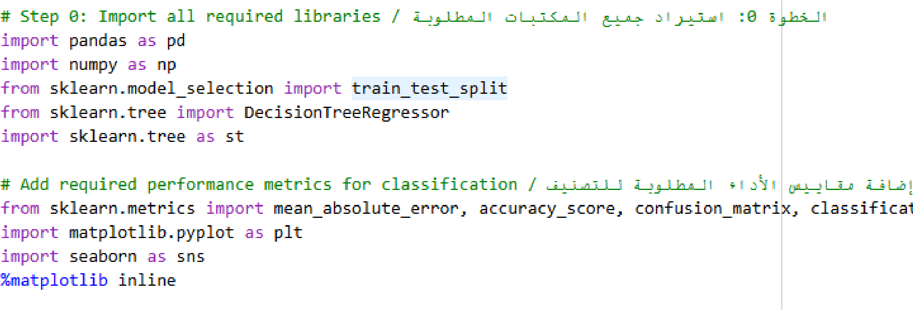

**Step 2 — Load and clean CSV.** Load the CSV into a DataFrame (`low_memory=False`), drop rows missing Date, Time, or Pickup Location, combine Date and Time into a single datetime, sort chronologically, and extract features: hour, day of week (0 = Monday … 6 = Sunday), date-only, and a weekend flag (1 for Saturday/Sunday). Pickup Location is cast to string, trimmed, and stripped of quotes.

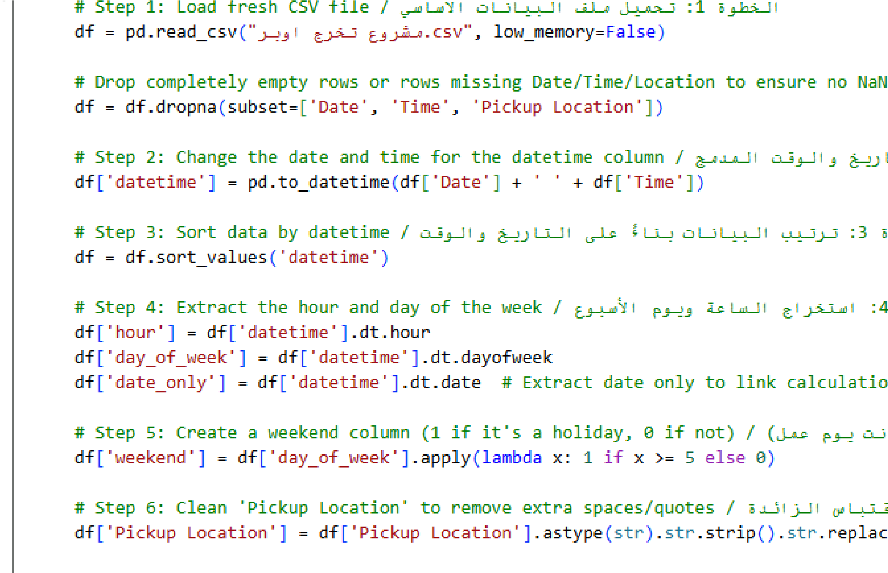

**Steps 3–4 — Encode, define features, split, and train.** Categorical columns (Vehicle Type, Pickup Location, Drop Location, Payment Method) are one-hot encoded. Features (X) keep only numeric columns with missing values filled (0 for features, median for the target). The data is split 80/20 and a Decision Tree Regressor with `max_depth=10` is trained.

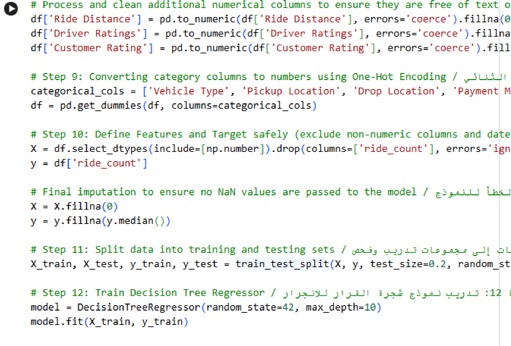

**Step 5 — Predict and evaluate.** The model predicts ride counts on the test set, and MAE measures average prediction error.

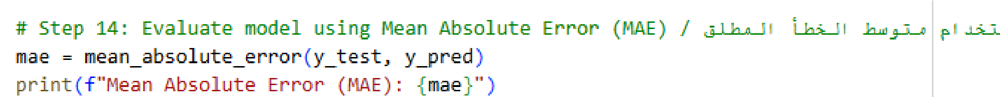
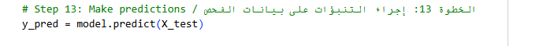

**Step 6 — Classification metrics.** Predicted and actual values are rounded to integers and clipped to 1–5 to compute an accuracy score, confusion matrix, and classification report (precision, recall, F1).

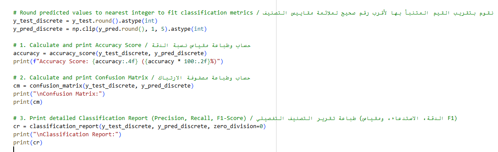

**Step 7 — Plots.** A seaborn heatmap of the confusion matrix (saved as `confusion_matrix.png`), a line plot of actual vs. predicted ride counts (`actual_vs_predicted.png`), and a diagram of the first three levels of the trained tree (`decision_tree_structure.png`).

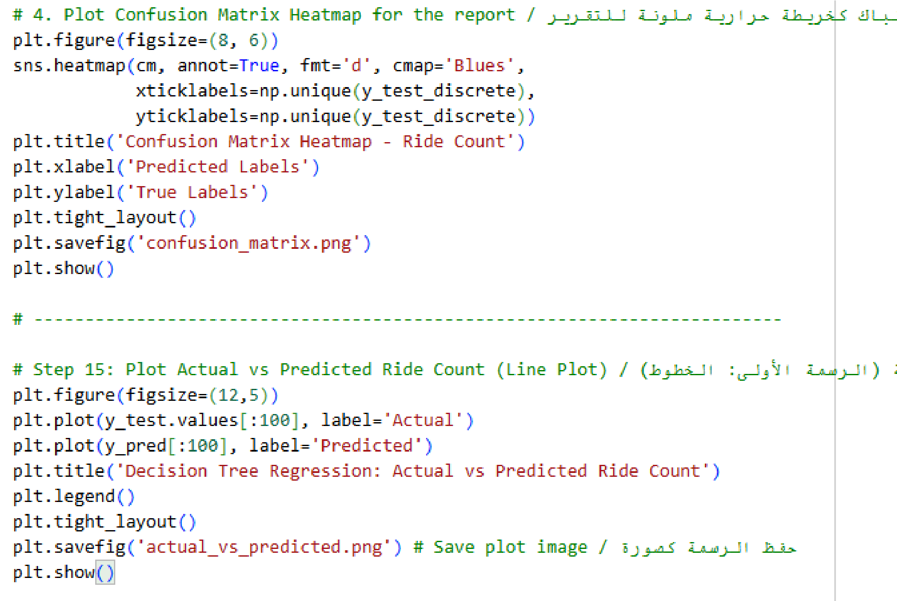
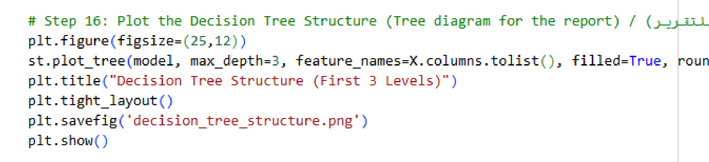

#### Outputs

**Decision tree structure.** The tree predicts ride counts from features such as hour of day, day of week, weekend indicator, previous-hour rides, ride distance, driver and customer ratings, vehicle type, pickup/drop location, and payment method. From the root node, each branch splits the data by a feature condition; leaf nodes give the final predicted ride count, with darker node colors indicating more confident predictions.

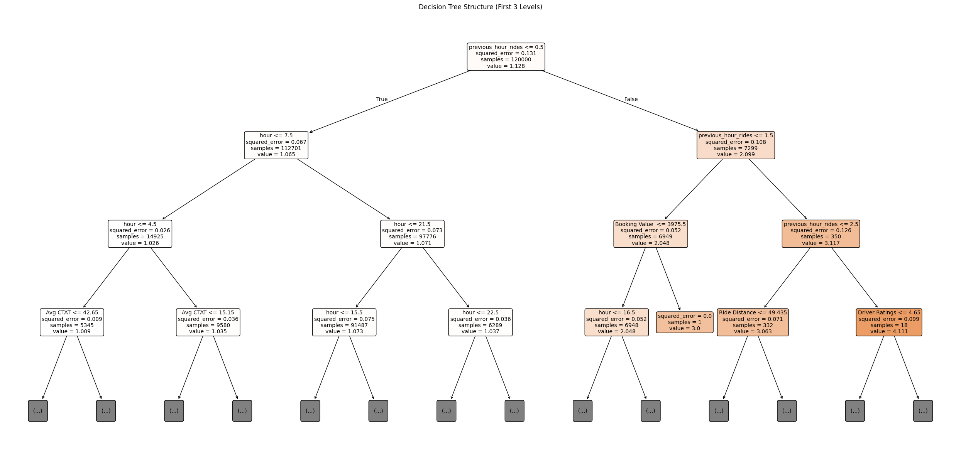

**Confusion matrix.** Diagonal values are correct predictions: class 1 was predicted correctly 26,481 times, class 2 1,592 times, class 3 71 times. Off-diagonal values are errors. The model performs best on lower ride-count classes (especially class 1), with accuracy decreasing for higher classes due to fewer samples.

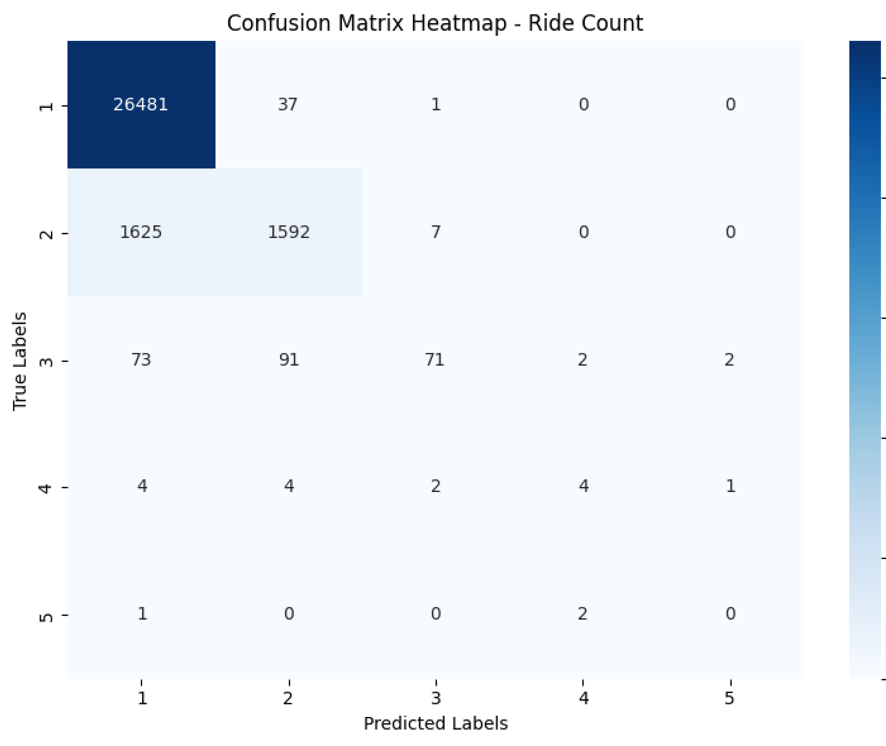

**Performance evaluation.** The model achieved **MAE 0.118** and an **accuracy of 93.83%**. Class 1 reached precision 0.94, recall 1.00, F1 0.97; weighted averages were precision 0.94, recall 0.94, F1 0.93. Lower performance on higher ride-count classes is attributed to class imbalance (most observations are class 1).

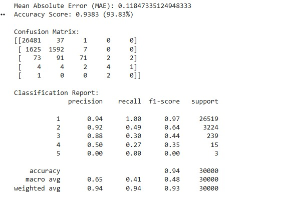

**Actual vs. predicted.** The predicted line generally follows the actual line, closely matching for the most frequent ride-count levels, with minor over/under-estimation at some points — demonstrating good predictive performance.

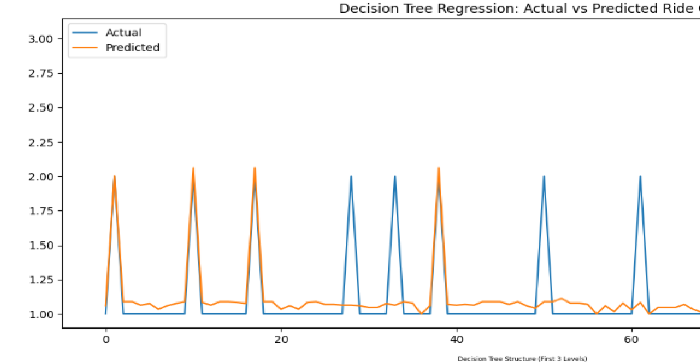

---

### Model 2 — Predicting Booking Status (Neural Network Classifier)

*Will a trip be completed or canceled? Based on passenger data such as trip time, distance, ratings, payment method, and pickup location.*

**Step 1 — Import libraries.** Data handling (pandas, numpy), visualization (matplotlib, seaborn), ML preprocessing/metrics (`train_test_split`, `StandardScaler`, `accuracy_score`, `confusion_matrix`, `classification_report`), and Keras modules: `Sequential`, `Dense`, `Dropout`, and the `EarlyStopping` callback.

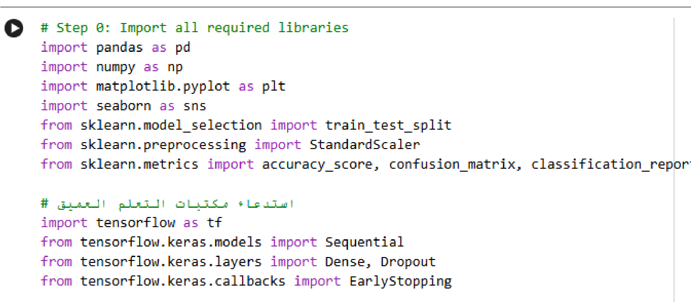

**Step 2 — Load CSV and preprocess date/time.** Load the CSV, drop rows missing Date, Time, or Booking Status, and combine Date and Time into a datetime column.

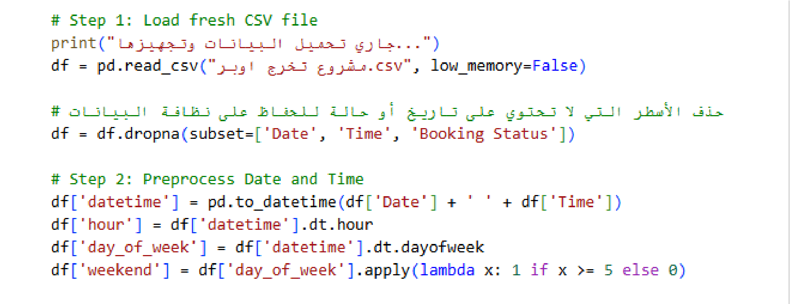

**Step 3 — Create the classification target and clean numeric columns.** Categorical columns (Vehicle Type, Pickup Location, Payment Method) are one-hot encoded with the first category dropped to avoid multicollinearity. Numeric columns (Ride Distance, Driver Ratings, Customer Rating, Booking Value) are coerced to numeric, with invalid entries filled by defaults (0 for distance/value, 4.0 for ratings).

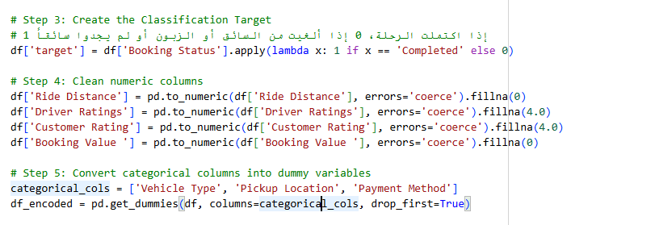

**Step 4 — Dummy variables and feature/target definition.** Base numeric/engineered features (hour, day_of_week, weekend, Ride Distance, Driver Ratings, Customer Rating, Booking Value) plus encoded categoricals form X (cast to float32); y is the target.

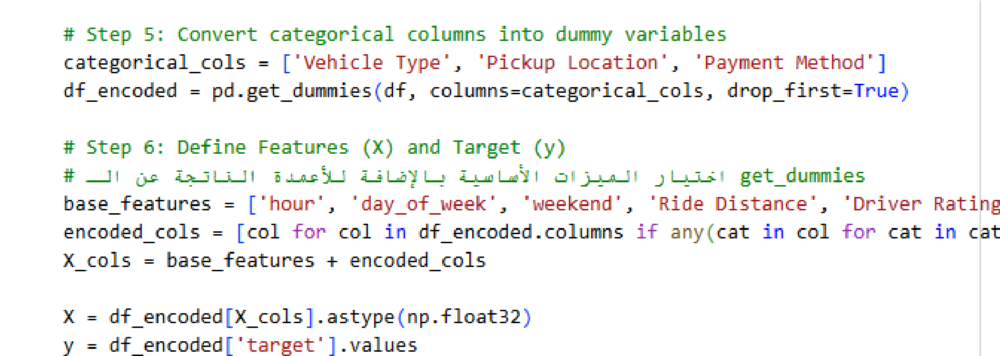

**Step 5 — Split and scale.** An 80/20 split (`test_size=0.2`, `random_state=42`) followed by `StandardScaler` (fit on train, applied to both), which helps deep models converge.

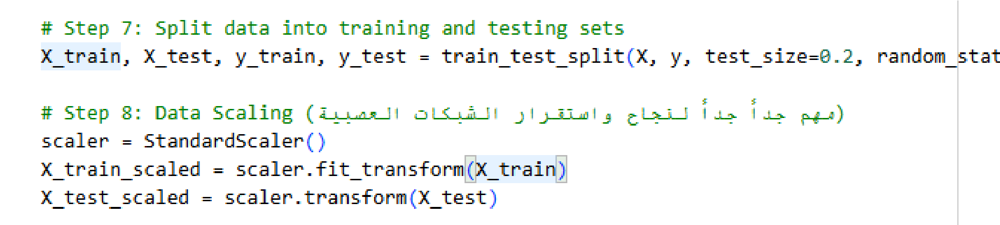

**Step 6 — Build the network.** A Sequential model: Dense(64, ReLU) → Dropout(0.2) → Dense(32, ReLU) → Dropout → Dense(1, sigmoid) for binary classification.

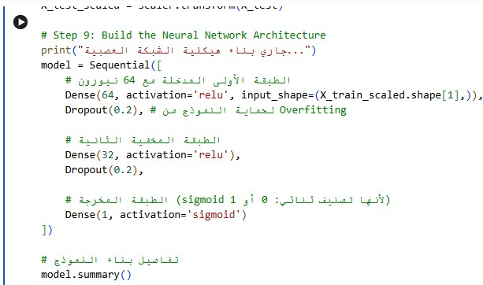

**Step 7 — Compile, train, evaluate.** `EarlyStopping` monitors validation loss (patience 3, best weights restored). Training uses batch size 256, up to 15 epochs, validation split 0.1. Predicted probabilities > 0.5 map to class 1, else 0.

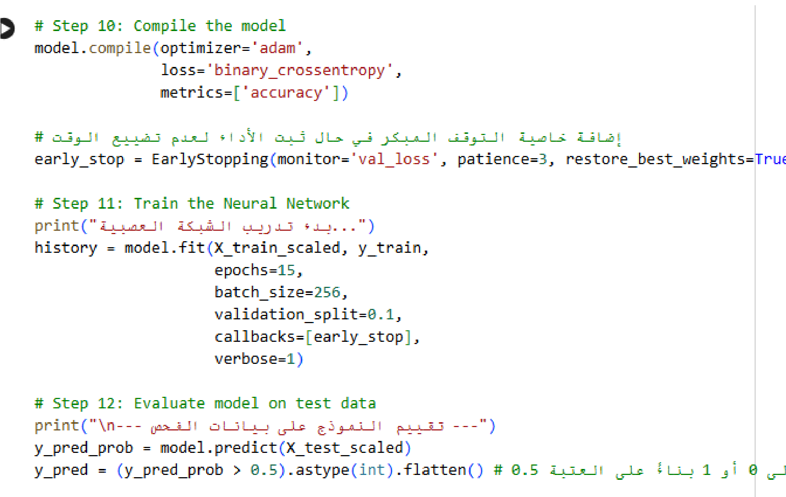

**Step 8 — Accuracy, confusion matrix, classification report.** Accuracy compares predicted vs. actual labels; the confusion matrix and report (precision, recall, F1, support) summarize performance.

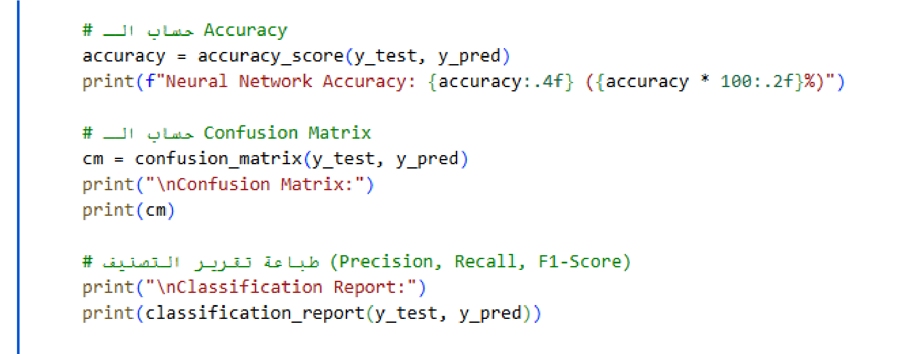

**Step 9 — Plots.** Training/validation accuracy and loss curves, plus a confusion-matrix heatmap (red colormap, axes labeled Cancelled/Incomplete and Completed, saved as `nn_confusion_matrix.png`).

#### Outputs

```
Confusion Matrix:
[[3167   28]
 [  41 5306]]

Classification Report:
              precision    recall  f1-score   support
           0       0.99      0.99      0.99      3195
           1       0.99      0.99      0.99      5347
```

The classifier correctly identified **3,167** cancelled/incomplete bookings and **5,306** completed bookings, with only 28 false positives and 41 false negatives. Both classes reached precision, recall, and F1 of 0.99 — strong, reliable, and well-generalized performance for booking-status prediction.

**Architecture summary.** Dense(64) input layer (12,416 parameters) → Dropout → Dense(32) hidden layer (2,080 parameters) → Dropout → Dense(1, sigmoid) output (33 parameters), for **14,529 trainable parameters** total — a balanced design combining feature learning with overfitting prevention.

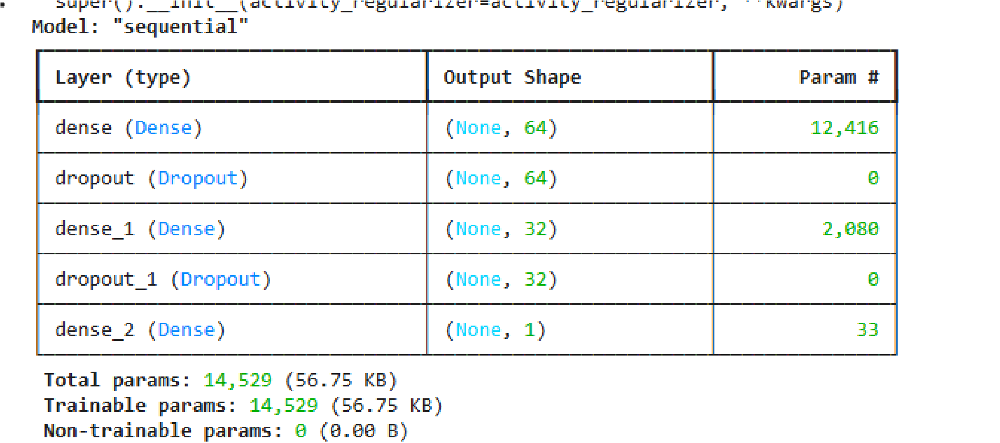

**Learning curves.** Training accuracy rose from ≈ 88% to nearly 99%, with validation accuracy tracking closely; loss for both sets fell toward zero. The close alignment of curves indicates good generalization without significant overfitting.

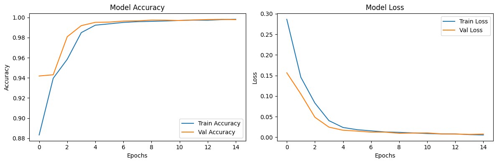

**Confusion-matrix heatmap.** The large diagonal values (3,167 and 5,306) with minimal off-diagonal errors (28 and 41) confirm very high classification accuracy.

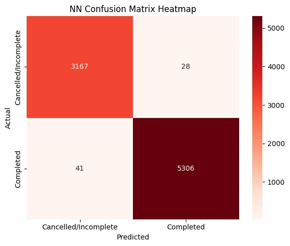

---

### Model 3 — Number of Rides per Hour per Region (Deep ANN Regressor)

This analysis examines the distribution of ride requests across regions during each hour, to detect peak demand periods and the most active regions — supporting driver allocation, operational efficiency, and demand forecasting.

**Step 1 — Import libraries.** pandas, numpy, matplotlib, seaborn, `train_test_split`, `StandardScaler`, evaluation metrics (`mean_absolute_error`, `accuracy_score`, `confusion_matrix`, `classification_report`), and TensorFlow/Keras (`Sequential`, `Dense`, `Dropout`, `EarlyStopping`).

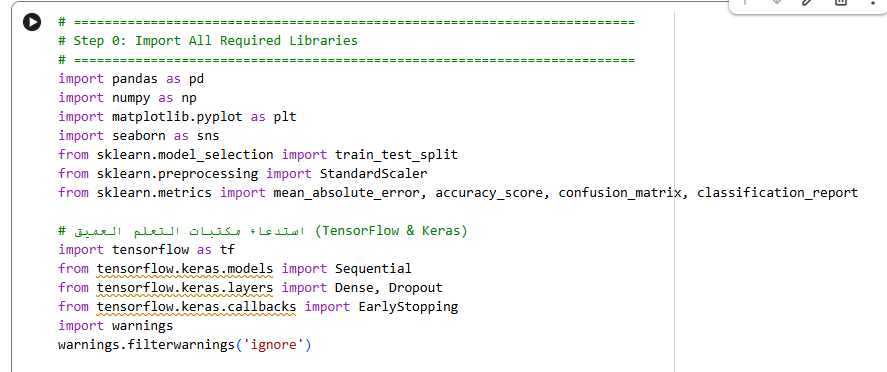

**Step 2 — Read and clean the dataset.** `read_csv(..., low_memory=False)` then drop rows missing Date, Time, Pickup Location, or Drop Location.

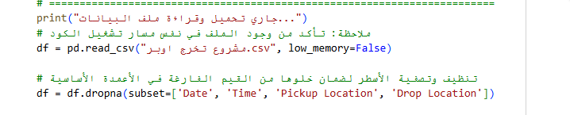

**Step 3 — Date/time feature engineering.** Combine Date and Time into a datetime via `to_datetime()`, sort chronologically, and extract hour, day of week (Monday 0 … Sunday 6), a weekend indicator (1 for Sat/Sun), and a date-only column.

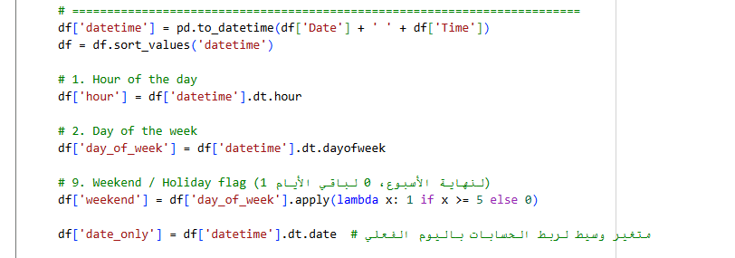

**Step 4 — Feature engineering and target creation.** Standardize text columns (pickup/drop location, vehicle type, payment method), create a previous-hour-rides feature to capture historical activity, and build the target `ride_count` (total rides per hour per region).

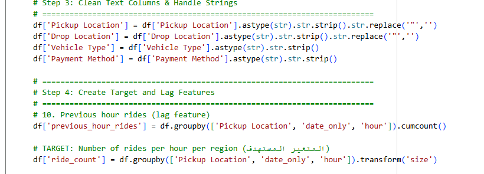

**Step 5 — Numerical cleaning.** Convert Ride Distance to numeric (invalid → 0); convert Avg VTAT and Avg CTAT to numeric (missing → column median).

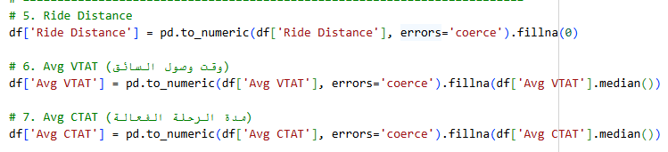

**Step 6 — Define features and target.** Select numeric/engineered features (hour, day of week, weekend, ride distance, average arrival times, previous-hour activity) plus encoded categoricals; cast to float32 and fill remaining missing values with 0.

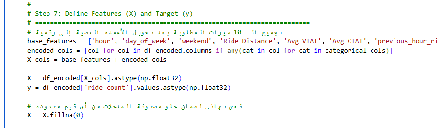

**Step 7 — Split and scale.** 80/20 train/test split followed by `StandardScaler` normalization for stable training.

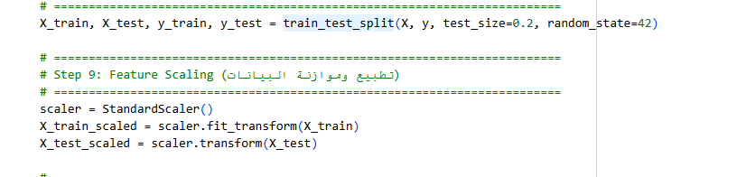

**Step 8 — Build the deep model.** A Sequential ANN for regression: hidden layers of 128, 64, and 32 neurons (ReLU) with Dropout layers between them, and a single linear-activation output neuron for continuous prediction. `model.summary()` displays the structure.

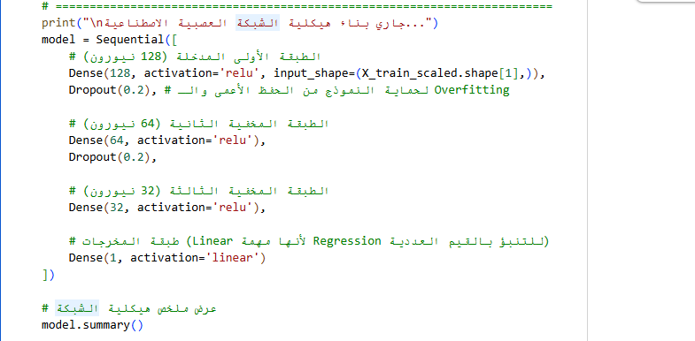

**Step 9 — Train with early stopping.** `EarlyStopping` monitors validation loss (patience 3); training uses 15 epochs, batch size 256, and a 0.1 validation split.

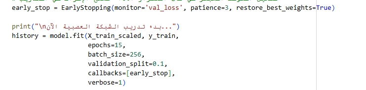

**Step 10 — Evaluate.** Predict on the test set, compute MAE, then round predictions to integers to compute accuracy, confusion matrix, and classification report.

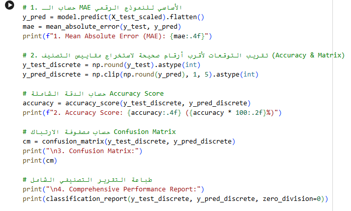

**Step 11 — Visualize.** Plot learning curves (training/validation loss) and a confusion-matrix heatmap to assess convergence and classification quality.

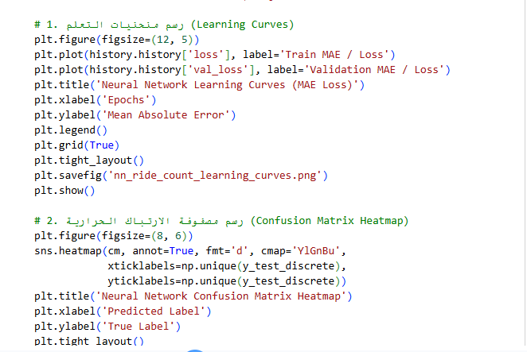

#### Outputs

**Architecture.** A fully connected Sequential network: Dense(128, ReLU) input → Dropout(0.2) → Dense(64, ReLU) → Dropout(0.2) → Dense(32, ReLU) → Dense(1, linear) output. **Total parameters: 12,641**, all trainable (0 non-trainable), optimized with Adam. The design balances capacity to learn complex patterns with being lightweight enough to avoid overfitting.

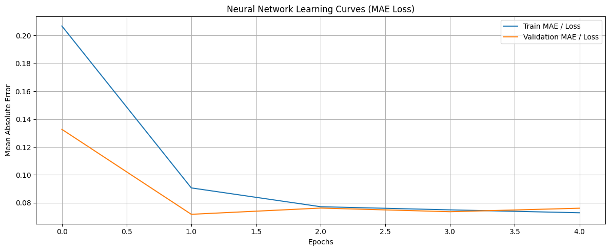

**Training convergence.** Trained in micro-batches of 256 with a 10% validation split, using Adam and an MAE loss. Epoch 1 started at training loss 0.3703 / val_loss 0.1983; by Epoch 4 these fell to 0.1472 / 0.1374; validation error stabilized at ≈ 0.1367 by Epoch 5. EarlyStopping (patience 3, `restore_best_weights=True`) halted training at Epoch 7, preventing overfitting and keeping the best weights.

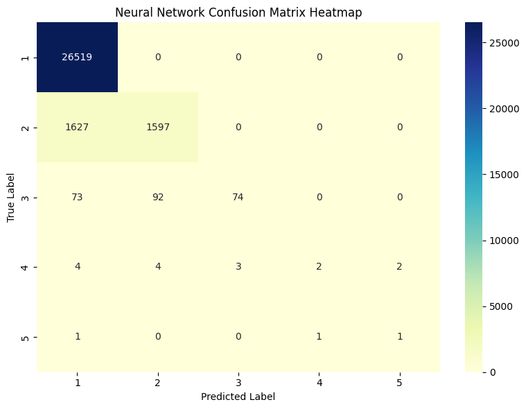

**Final metrics.** Feature matrix shape (19,994 samples × 11 features). Final **MAE ≈ 0.1367** and **accuracy 95.89%** after mapping outputs to discrete demand scales, with macro average 0.97 and weighted average 0.96 — balanced performance across demand levels.

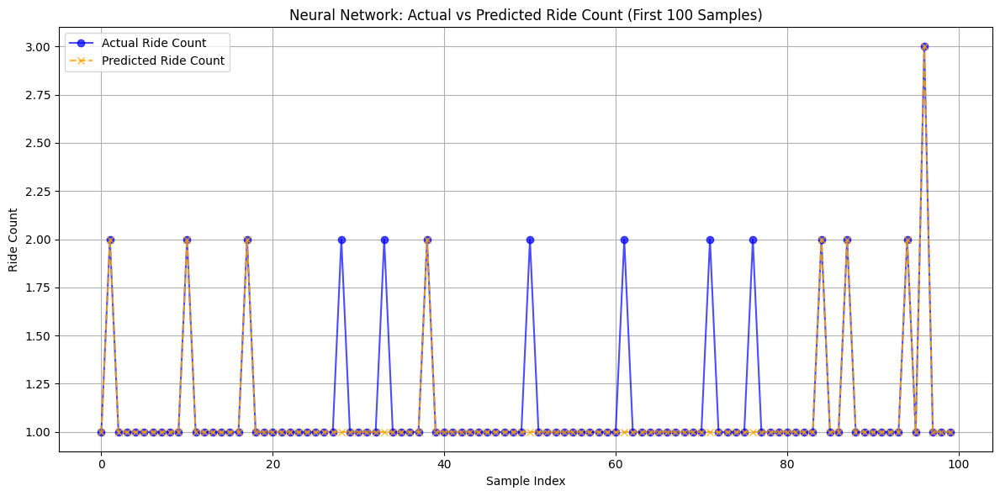

**Visual confirmation.** The MAE training/validation curves collapse together and plateau (no overfitting); the confusion heatmap clusters tightly on the diagonal; and plotting actual vs. predicted values for the first 100 test points shows near-identical path matching, tracing real-time spikes and drops in ride density accurately.

---

## Tools Research and Selection Effort

| Area | Tools used | Why |
| --- | --- | --- |
| Data analysis & ML | Python 3, Pandas, NumPy, Scikit-learn | Industry-standard data-science stack for cleaning, transformation, and modeling |
| Deep learning | TensorFlow / Keras | Building, stacking, and optimizing sequential neural networks |
| Visualization (analysis) | Matplotlib, Seaborn | Confusion-matrix heatmaps, learning curves, and statistical plots |
| Development environment | Google Colaboratory | Free, cloud-based GPU/CPU notebooks for the AI workflow |
| BI dashboard | Power BI *(implied by dashboard visuals)* | Interactive dashboards organized by business question |
| Spreadsheet analysis | Microsoft Excel *(implied by pivot tables)* | Descriptive pivot-table analysis (monthly orders, vehicle types, payments, locations) |
| Design / supporting assets | Canva | Visual/diagram assets |

> _TODO: confirm and name the exact BI/spreadsheet tools used for the dashboard and pivot tables — they are evident from the figures but not stated explicitly in the source._

---

## Project Deployment Effort – Use Case

> _Note: the source document describes how the analysis and models would be used and the value they create, rather than a built deployment (e.g., a hosted web app). The intended use cases are captured below; a concrete deployment mechanism is marked as a next step._

**How a business user would consume this project.** Through an interactive BI dashboard (Overview, User Behavior, Map Analysis, Relationships) for monitoring operations, supported by the predictive models running behind the scenes to flag high-risk bookings and forecast demand.

**Intended operational use cases**
- **Proactive resource allocation:** embed the spatio-temporal ANN to guide drivers toward anticipated high-demand zones before peak hours, reducing customer waiting time (CTAT) and fuel waste.
- **Cancellation prevention:** use the binary classifier to flag high-risk bookings before a driver is dispatched, protecting revenue and driver time.
- **Pricing and coverage optimization:** use map and relationship insights to target high-value areas and ensure adequate fleet coverage.

**Localized deployment value (Jordan):** alleviating urban congestion in Amman, Irbid, and Zarqa; supporting the National Vision for Digital Transformation; and improving driver income security through fuel-efficient routing.

**Next steps (TODO):** package the trained models behind a live API or an interactive web app (e.g., Streamlit / FastAPI / Flask / Gradio), describe hosting and scheduling, and localize with Jordanian transportation data.

---

## Results

### Descriptive & operational insights
- **Volume & status:** 148,770 total bookings for 2024; **65.96%** completed, the remainder cancelled or incomplete.
- **Cancellation dynamics:** overall cancellation rate ≈ **25%**; customers account for **19.15%** (≈ 27,000 rides) vs. drivers at **7.45%** (≈ 10,500 rides).
- **Temporal demand:** peaks in **January and July**; lowest in **April and October**. **Saturdays and Mondays** are busiest, with volumes rising sharply after **12:00 PM**.
- **Fleet & payments:** **Auto** and **Go Mini** are the most-used vehicle types; **UPI** leads payments (~40%), followed by **Cash** (~25%).
- **Spatial highlights:** **Khandsa** is the top pickup origin; **Ashram** is the most frequent destination.

### Predictive modeling results
- **Ride demand forecasting (Decision Tree Regressor):** ≈ **93.83% accuracy**, **MAE 0.118**.
- **Spatio-temporal ride-count prediction (Sequential ANN):** converged by Epoch 7 (EarlyStopping), ≈ **95.89% accuracy** (continuous MAE ≈ 0.068–0.137 across reported runs), with tight actual-vs-predicted alignment.
- **Ride cancellation classification (ANN):** ≈ **99.75% testing accuracy**, **F1-score 1.00**, reliably flagging high-risk bookings before dispatch.

### Strategic recommendations
- **Proactive resource allocation:** embed the spatio-temporal ANN to pre-position drivers and cut customer waiting time and fuel waste.
- **Reduce booking errors:** since "Wrong Address Entry" drives over **22.5%** of customer cancellations, enhance GPS address validation and add an intuitive auto-complete map interface.
- **Address driver capacity issues:** since "Vehicle Capacity Issues" cause **25%** of driver cancellations, focus fleet expansion on mid-to-large capacity vehicles during weekend peaks.

### Project achievements & contributions
1. An integrated, data-driven framework that turns raw ride-sharing logs into actionable business intelligence, bridging descriptive analysis and real-time forecasting.
2. A deep-learning binary classifier that detects high-risk cancellations at **99.75%** accuracy, enabling dispatch systems to gate or flag volatile orders.
3. Production-ready demand forecasting (**93.83%** via Decision Trees; **95.89%** via the spatio-temporal ANN) for dynamic vehicle repositioning.
4. Isolation of structural bottlenecks — **22.5%** of customer cancellations from "Wrong Address Entry" and **25%** of driver cancellations from "Vehicle Capacity Issues" — giving developers clear diagnostic targets.
5. A scalable, adaptable pipeline that can be localized with Jordanian smart-transportation data to ease congestion and support digital micro-entrepreneurship.

### Flowchart

A flowchart is a diagram made of boxes and arrows that can represent an algorithm (a step-by-step set of directions), a process (a sequence of stages ending in a result), or the planned stages of a project.

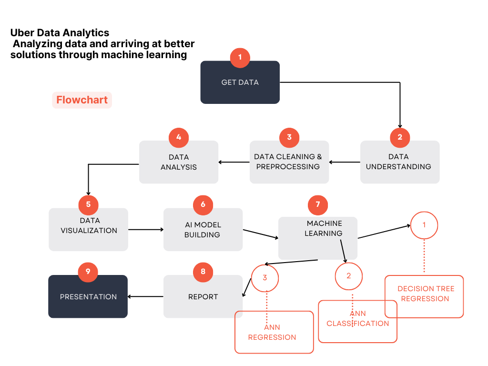

---

## References

- Kaggle — Uber Ride Analytics Dashboard dataset: https://www.kaggle.com/datasets/yashdevladdha/uber-ride-analytics-dashboard/code
- Generative AI & computational assistants (used as supporting tools)
- YouTube — Omar (tutorial channel): https://www.youtube.com/@Omar2366
- Wikipedia — National Capital Region (India): https://en.wikipedia.org/wiki/National_Capital_Region_(India)
- Canva (design assets)

> _Tip: convert these into a consistent citation style (APA or Chicago) for the final submission._

---

## Code Setup and Dependencies

1. Clone the repository:
   ```bash
   git clone <repository-url>
   ```
2. Navigate to the project directory:
   ```bash
   cd <project-directory>
   ```
3. (Optional) Create and activate a virtual environment:
   ```bash
   python -m venv venv
   source venv/bin/activate   # Windows: venv\Scripts\activate
   ```
4. Install dependencies:
   ```bash
   pip install -r requirements.txt
   ```
5. Open the analysis notebooks (the AI models were developed in Google Colab):
   ```bash
   jupyter notebook
   ```
